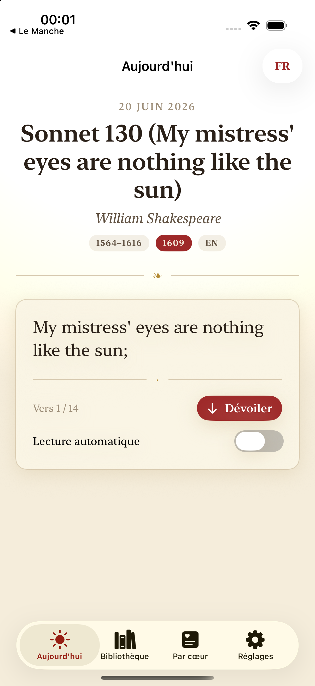
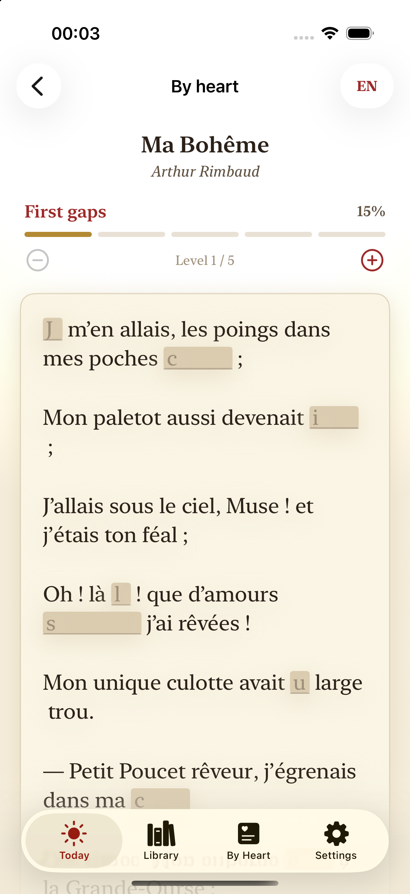
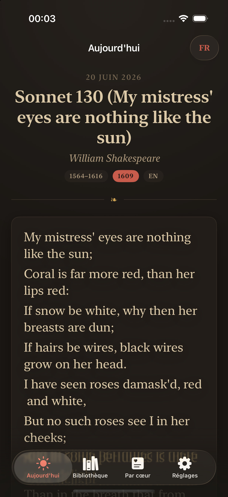

# Le Récital

*Un poème par jour, appris par cœur. — A poem a day, learned by heart.*

A native iOS / iPadOS app for the **Atelier / La Shop** family: a fine little
chapbook that gives you one public-domain poem each day, helps you understand
*why it works*, and walks you — gently, level by level — all the way to knowing
it by heart. French-first, fully bilingual (FR / EN).

<p align="center">
  
  
  
</p>

## What it does

- **Aujourd'hui / Today** — a deterministic poem of the day (same date → same
  poem), cycling through all 30 poems without repeats and never showing the same
  poem two days running. A *prefer my language* setting biases the daily pick
  toward your interface language while still rotating both over time.
- **Slow typographic reveal** — the poem unveils line by line at a gentle pace,
  tap-to-advance or an auto-pace toggle, set in an elegant serif on warm paper.
- **Craft note** — after the read, a short "why this poem holds" note in your
  language, plus the source attribution.
- **Apprendre par cœur** — progressive word-masking across six levels (≈15 % of
  words hidden with first-letter hints → fully blank "par cœur"). Recite, tap a
  blank to peek. Each harder level strictly contains the easier one.
- **Leitner SRS** — clearing the top level adds the poem to your repertoire and
  schedules spaced reviews so it stays learned. A *to review* queue resurfaces
  poems that are due.
- **Réciter & s'enregistrer** — record yourself reciting (device microphone),
  keep, play back, share, and delete your takes.
- **Bibliothèque / Library** — browse all poems by poet, era, or language;
  favorites; search by title, poet, or first line; the learned-by-heart shelf
  with mastery rings.
- **Soir / nightstand mode** — a warm, dim, low-blue palette for bedtime reading.
- **Approfondir (optional)** — if a Claude API key is present, a deeper reading
  on demand. The app is fully functional without it; the button is hidden when
  no key is found. The key is read from `CLAUDE_API_KEY` or the first line of
  `~/.recital/config` and is never hardcoded.

## The poems

All 30 poems are **public-domain works** (17 English, 13 French), each attributed
in its record. English texts are sourced from **PoetryDB**; French texts from
**Wikisource**. The complete dataset lives in `iOS/Resources/Poems.json` and is
bundled as an app resource, loaded at launch via `Bundle.main`.

## Build

Requires Xcode 27+, [`xcodegen`](https://github.com/yonaskolb/XcodeGen), and an
Apple Developer team (configured as `9WZ66DZ69J` in `project.yml`).

```bash
./gen.sh        # regenerate LeRecital.xcodeproj (+ refresh the opaque app icon)
```

Debug (Simulator):

```bash
xcodebuild -project LeRecital.xcodeproj -scheme LeRecital -configuration Debug \
  -destination 'platform=iOS Simulator,name=iPhone 17' \
  -derivedDataPath /tmp/le-recital-dd build
```

Run the tests (deterministic daily selection, progressive masking, SRS, and
dataset integrity — counts/structure only):

```bash
xcodebuild test -project LeRecital.xcodeproj -scheme LeRecital \
  -destination 'platform=iOS Simulator,name=iPhone 17' \
  -derivedDataPath /tmp/le-recital-dd
```

Release for a device:

```bash
xcodebuild -scheme LeRecital -configuration Release \
  -destination 'generic/platform=iOS' -allowProvisioningUpdates \
  -derivedDataPath /tmp/le-recital-rel build
```

> **Build out of iCloud.** This repo lives under `~/Claude` (Obsidian-synced),
> so always build into `/tmp/...` DerivedData. iCloud/sync extended attributes
> make `codesign` refuse to sign the bundle.

## Install to a device

```bash
./install-device.sh
```

Builds **Release** (the modern Debug stub needs Xcode to launch it) into `/tmp`
DerivedData and installs to the first connected, unlocked iPhone/iPad. Needs
Developer Mode on and a signed-in Apple Developer account.

## A note on the microphone

Recording your recitation needs a real microphone, so it is **device-only**. In
the Simulator the recorder degrades honestly: the record panel shows a plain
"recording needs a microphone — available on your iPhone or iPad" note instead
of pretending to capture silence. `NSMicrophoneUsageDescription` is localized
(FR / EN); audio stays on-device and is never transmitted.

## Layout

```
project.yml              # xcodegen spec (DEVELOPMENT_TEAM in base settings)
gen.sh / install-device.sh
iOS/Info.plist, *.lproj  # bilingual Info.plist strings
iOS/Resources/Poems.json # the 30-poem public-domain anthology (bundled)
Sources/
  Models/   Poem, Masking, SRS, DailyPoem, Library, Settings, Deepen, …
  Audio/    Recorder (device MicRecorder / Simulator fallback via a protocol)
  Util/     Loc (FR/EN), Theme (jour/soir chapbook palette)
  Views/    Today, Memorize, Recite, Library, Shelf, Settings, VerseView, …
Tests/      DatasetTests (integrity), LogicTests (selection/masking/SRS)
```

---

Part of Jac's Atelier. Native — no web, no Netlify.
